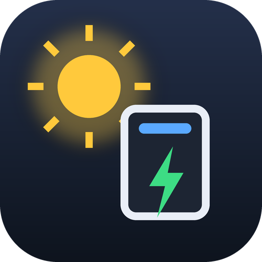
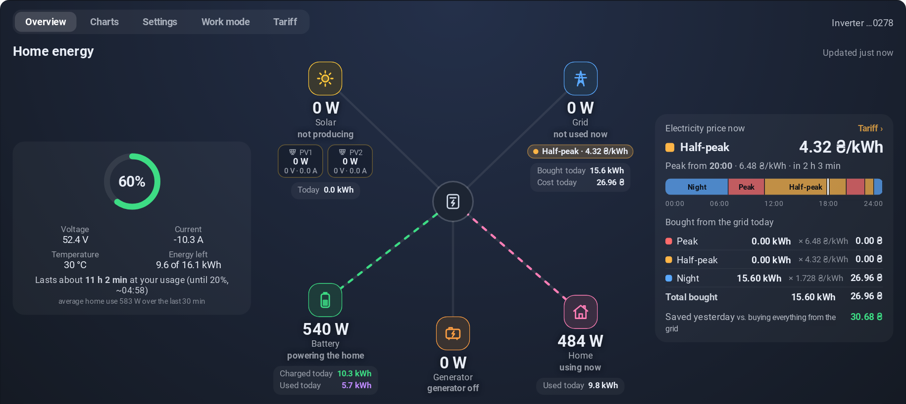
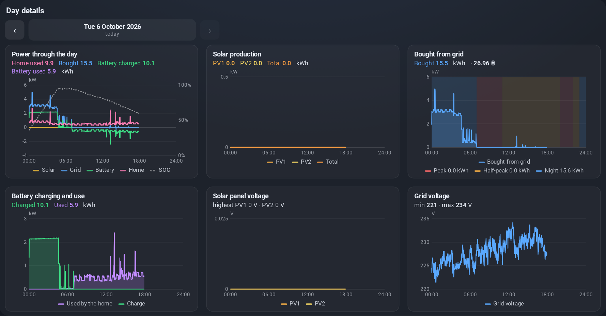
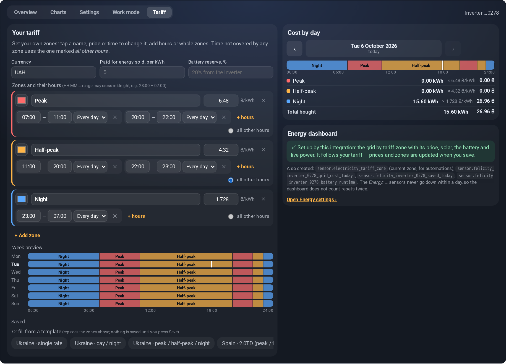
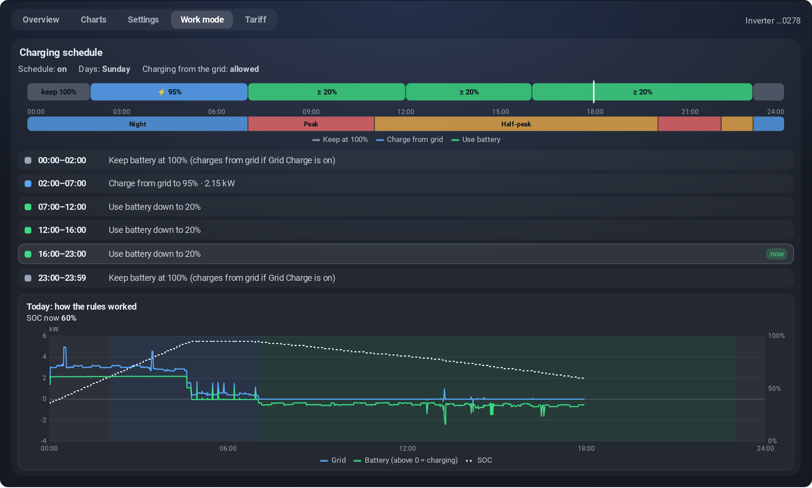
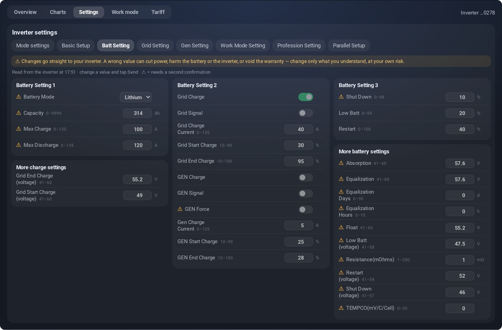
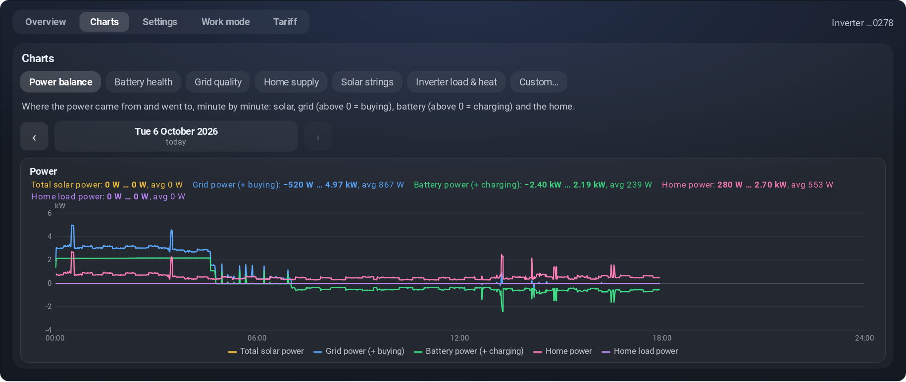
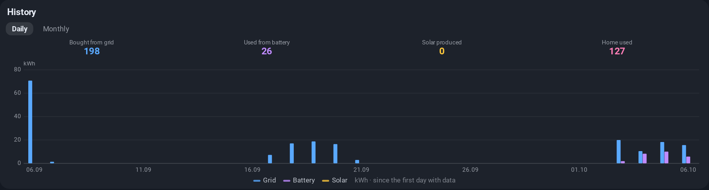
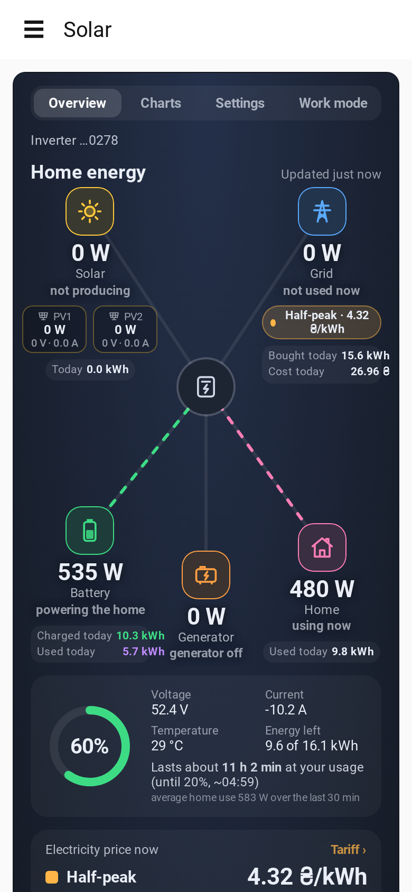

# Felicity Inverter Integration Cloud

**Your Felicity Solar inverter, battery and electricity bill — live in Home Assistant.**

Energy flow, charts, every inverter setting, time-of-use tariffs with real costs, an Energy dashboard that sets itself up,
and Matter plugs for Apple Home — through the official Felicity cloud API, no extra hardware.

 

---

## Why

The Felicity app shows your system, but it can't switch a lamp when the battery is full. It also doesn't know what your
electricity costs, and it isn't next to the rest of your home. This integration brings all of it into Home Assistant:
- live data as soon as the cloud has it (polled every 15 seconds);
- the inverter's full settings, with guard rails;
- the money side: what each kWh cost, in which tariff zone, and what the solar and the battery saved you.

It is built and used on a real home system: an **IVAM6048** inverter with a **314 Ah** LiFePO₄ pack, on the Ukrainian three-zone tariff.

> [!WARNING]
> **Use at your own risk.** This integration can change your inverter's and battery's settings. A wrong setting can
> cut power to your home, damage the inverter, the battery or connected equipment, or void the manufacturer's
> warranty. Change only what you understand, follow the Felicity manual, and leave installation and grid settings to a
> qualified electrician. Costs, savings and runtime are estimates. The software comes with **no warranty**, and the
> author accepts **no liability** for any damage — see [LICENSE](LICENSE).

## Highlights

| Feature | What you get |
|---|---|
| ⚡ **Live energy flow** | Solar (per string, with V and A), grid, battery, home and the GEN / smart-load port, with today's kWh next to each, like the Sunsynk card |
| 🔋 **Battery you can read** | Level, voltage, current and temperature; how long it lasts at your usage down to the inverter's own reserve (from your usual use hour by hour), or when it will be full at the current charging power, with the clock time |
| 💸 **Tariffs and real costs** | Ukrainian 1/2/3-zone presets (to the kopeck: 6.48 / 4.32 / 1.728 ₴), Spain 2.0TD, UK Economy 7, your own zones or a dynamic price (Nord Pool, ENTSO-E, Tibber…). Grid import and cost per zone for today, yesterday or any month, to check against the bill, and what the battery saved |
| 📊 **Energy dashboard, set up for you** | One grid connection per tariff zone with its price, solar, battery with SOC and live power flows, kept in step with your tariff |
| 🛠 **All inverter settings** | Laid out like the Felicity app and editable, checked against the inverter's own limits; risky ones need a second confirmation |
| 🕑 **Work mode** | The time-of-use schedule on a 24-hour timeline, over your tariff zones, with a hint when grid charging runs in an expensive zone |
| 📈 **Charts** | Six day charts (power, solar, grid with tariff zones, battery, panel voltage, grid voltage with blackouts), history by day and month, and a chart explorer with diagnostic presets like the Felicity data filter |
| 🍏 **Matter plugs** | Optional Home / Battery / Grid plugs with power and energy, for Apple Home and other Matter controllers (via a Matter bridge) |
| 📱 **Made for phones** | A "Solar" sidebar panel and eight dashboard widgets that work at 390 px; dark theme, no horizontal scrolling |

## A closer look

### Overview and day details

Today's numbers sit next to every node of the flow:
- solar produced;
- bought from the grid and what it cost;
- the battery charged and used;
- what the home used.

The price panel shows the price now, when the next zone starts, a 24-hour zone strip, and today's grid import split by
zone with its cost. The battery panel says how long the battery lasts at your usage (down to the reserve) or, while
charging, when it will be full; both with the clock time.

Six day charts below let you step through any past day: power, solar, grid import over the tariff zones, battery,
panel voltage, and grid voltage with the time without grid.

### Tariff

Pick a ready tariff, or build your own zones: any names, prices and hours, several time ranges per zone, ranges across
midnight, weekdays-only or weekend-only hours.
- **Week preview and warnings.** A week preview shows the result, and overlapping hours are flagged.
- **Price changes apply at once,** without a restart. A change made mid-day applies from that minute; earlier minutes and past days keep the prices they had.
- **The split by zone is exact.** It uses the inverter's own grid-import counter, not estimates from power samples. The Ukrainian presets match a real bill to the kopeck (the night rate is 1.728 ₴, not the 1.73 printed on it).
- **Days and months.** Switch between today, yesterday, this month and last month; *Cost by month* lists every day with its kWh per zone, to compare with the bill. Past days are fetched once in the background and kept.
- **Where the savings come from.** Your home's use at zone prices, what you paid for the grid, and the battery's part: what charging it from the grid cost (losses included) and what its energy would have cost in the zones it was used.

### Work mode

The time-of-use rules from the inverter, drawn over the tariff zones and today's grid, battery and SOC. If a rule
charges from the grid during a dearer zone, the card says so and names the cheapest one.

### Settings

Every setting the inverter reports, grouped like the Felicity app. Change a value and press **Send**.
- **Limits.** Values are checked against the inverter's own limits, including each field of a time-of-use rule.
- **Risky settings** (battery type, voltages, grid code, parallel set-up…) need a second **Confirm**.
- **Blocked:** factory reset, remote power-off and log clearing can't be sent at all.

### Charts and history

### On a phone

## Installation

1. Copy `custom_components/felicity` into your Home Assistant `config/custom_components/` folder.
2. Restart Home Assistant.
3. **Settings → Devices & services → Add integration → Felicity Inverter Integration Cloud.**
4. Read and accept the risk notice (the integration can change inverter settings), then sign in with your Felicity account (the one you use in the Felicity app). The account needs Open API access; ask Felicity support if sign-in is refused.

The **Solar** panel appears in the sidebar, and the cards appear in the dashboard card picker.

## Set-up

- **Tariff:** open **Solar → Tariff**, pick a template or set your zones, and press **Save**. The first save also sets up the Energy dashboard, if it is empty. You can also use **Configure → Electricity tariff** on the integration.
- **Battery reserve:** empty means the inverter's own *Low Batt* level (IVAM) or off-grid discharge depth (IVGM).
- **Matter plugs:** see [Matter plugs (Apple Home)](#matter-plugs-apple-home) below.

### Matter plugs (Apple Home)

Your inverter can show up in Apple Home (or Google Home, Alexa, SmartThings) as three smart plugs with live power
and energy: **Felicity Home** (what the home uses), **Felicity Battery** (battery discharge) and **Felicity Grid**
(bought from the grid). *Felicity Battery* also carries the battery level (%), which Apple Home shows in the plug's
details. The plugs never control the inverter: switching one off only sets its power and energy to 0.

Home Assistant does not speak Matter to Apple Home by itself, so a **Matter bridge** is needed. These steps use
[Matterbridge](https://github.com/Luligu/matterbridge) with its Home Assistant plugin.

1. **Create the plugs.** In Home Assistant open **Settings → Devices & services → Felicity Inverter Integration Cloud →
   Configure → Matter outlets** and turn on *Create Matter outlets*. Three devices appear: *Felicity Home*,
   *Felicity Battery* and *Felicity Grid*, each with a switch, a power sensor and an energy sensor.
2. **Labels are added for you.** The integration puts the label from *Label for your Matter bridge* (by default
   `matterbridge`) on the three devices and creates the label if it doesn't exist. Leave the field empty to add no label.
3. **Install Matterbridge** (Docker, or the Home Assistant add-on) and add the plugin **matterbridge-hass** with your
   Home Assistant URL and a long-lived access token.
4. **Let the plugin find the plugs.** In the plugin settings:
   - set **filterByLabel** to the same label (`matterbridge`), so only labelled devices are bridged;
   - make sure **entityWhiteList** (if you use it) contains `switch` and `sensor`.

   Restart the plugin. The bridge combines each device's switch, power and energy into one plug.
5. **Add the bridge to Apple Home.** Open the Matterbridge web page and scan its pairing QR code in the Home app
   (**+ → Add Accessory**). The three Felicity plugs appear with their power and energy.

Using another bridge? Give it the three devices, or the entities `switch.felicity_home`, `sensor.felicity_home_power`,
`sensor.felicity_home_energy` and the same for `battery` and `grid`. Use a different label in step 2 if your bridge
filters by another one.

### Widgets

All of them find their data by themselves; no entity configuration is needed.

| Card | Shows |
|---|---|
| `felicity-flow-card` | Everything, with tabs and an inverter picker |
| `felicity-energy-flow-card` | The live flow with today's numbers and the price panel |
| `felicity-day-charts-card` | Day charts with day navigation |
| `felicity-all-time-card` | Energy by day / month |
| `felicity-charts-card` | The chart explorer |
| `felicity-settings-card` | Inverter settings |
| `felicity-tou-card` | The time-of-use schedule |
| `felicity-price-card` | Price now, next zone, today's cost by zone |
| `felicity-tariff-card` | The tariff editor, cost by day and by month, Energy dashboard set-up |

### Entities

| Entity | Use it for |
|---|---|
| **Inverter and battery sensors** | Live values: solar, grid, battery, home, voltages, temperatures; plus the cloud's daily energy |
| `sensor.electricity_tariff_current_price` | *Energy → Use an entity with current price*, automations |
| `sensor.electricity_tariff_zone` | Automations ("run the boiler at night") |
| `…_grid_import_today_<zone>` | Grid import per tariff zone (Energy dashboard) |
| `…_energy_solar_today`, `…_energy_battery_charged_today`, `…_energy_battery_discharged_today`, `…_energy_sold_to_grid_today` | Energy dashboard meters; they never go down within a day |
| `…_grid_cost_today`, `…_saved_today` | Money: today's grid cost, and what solar and the battery saved |
| `…_grid_import_this_month_<zone>`, `…_grid_cost_this_month` | This calendar month so far, today included |
| `…_saved_this_month`, `…_battery_saved_this_month` | Savings over this month's finished days |
| `…_battery_runtime` | Hours the battery would carry the home down to the reserve, by your usual use hour by hour |
| `…_last_data` | When the cloud received the latest record (diagnostic); the card's *Updated … ago* counts from it |
| **Number / select / switch controls** | Inverter settings on the device page (risky ones only while *Unlock risky settings* is on) |

## Supported inverters

Every model in the Felicity Open API documentation is supported. Each inverter tells the integration which settings it
has and their limits, so settings, controls and the time-of-use schedule follow the model by themselves. Sensors are
created only for the values the inverter reports.

| Family | Models in the documentation | Status |
|---|---|---|
| **IVAM** | IVAM | Tested on IVAM6048P1G1: data, settings, schedule, tariffs |
| **IVEM / IVBM / IVPM / IVCM / IVPS / IVPA** | IVEM3024 … IVEM12048, IVEM-AI, IVBM8048/10048, IVPM (II), IVCM (II), IVPS, IVPA | Off-grid inverters: data, settings (charging / output priority, battery voltages and currents), tariffs |
| **IVGM** | IVGM5048 … IVGM100600 | Hybrid: home load behind the meter, explicit time-of-use rule modes, grid-code settings |
| **T-REX** | T-REX-6K … T-REX-15K | Three-phase: per-phase grid, output and generator values, up to four PV inputs, a second battery, grid-code and ride-through settings |
| **Felicity batteries** | LPBA and other BMS packs | Level, power, voltage, current, temperatures, BMS state |

Only the IVAM is tested on hardware; the others are built from the API documentation. Reports are welcome.

- **Watts or kilowatts.** Models and endpoints report powers differently (the documentation lists kW for T-REX and W
  for IVGM). The integration checks each record against its own voltage × current and converts.
- **Safety by family.** Grid-code curves, ride-through, protection (ISO, GFCI, arc fault), battery voltages and currents,
  parallel and metering settings need a second **Confirm**. Calibration factors, the device clock, factory reset,
  power-off and log clearing can't be sent at all.

## Good to know

- **One set of daily figures.** Every kWh figure (the flow, the day charts, the price panel, months, history and the
  Energy-dashboard sensors) comes from the same day figures. Grid import follows the inverter's own counter, the same
  as the Felicity app; home and battery energy are scaled to it, so they add up. Your utility meter may differ by a few
  per cent.
- **How fresh the data is.** Data comes from the Felicity cloud (Open API):
  - the inverter uploads about one record per minute, and a record reaches the API about 1–2 minutes after it was measured;
  - the integration polls every 15 seconds, so it shows each record as soon as the cloud has it;
  - the card's *Updated … ago* is the age of that record (the *Last data* sensor);
  - the Felicity app can show a newer value for a moment: it gets live data through its own channel, which the Open API does not offer.
- **History timestamps** from the API are Beijing time and powers are in kW; both are converted.
- **Grid current with zero grid power** happens while the home runs on the battery. It is the inverter's reactive standby current: no energy is bought.
- **The cloud's own "… today" sensors** can drop to 0 for a moment. Use the *Energy: …* sensors for the Energy dashboard.

## Support the project

If the integration saves you money (or just time), you can drop something into the jar:

<table>
<tr>
<td align="center" width="50%">

**🫙 monobank jar «отложить гривны»**

🔗 https://send.monobank.ua/jar/6YqKSm3yaD

💳 `4874 1000 3321 2872`
</td>
<td align="center" width="50%">

**💵 USDT · Tron (TRC20)**

`TV8M4HcRcc3jiX5EJmu9ggFXe4rWA4Cvx3`

Send only USDT on the Tron network (TRC20); other coins or networks will be lost.
</td>
</tr>
</table>

Thank you! 💛💙

## For developers

The integration lives in `custom_components/felicity/`:

| File | What it does |
|---|---|
| `api.py` | Felicity Open API client |
| `coordinator.py` | Polling, setting writes, the daily cost pipeline |
| `daystats.py` | Numbers from a day of minute history |
| `tariff.py` | The tariff model |
| `settings.py` | Settings layout and validation |
| `energy.py` | Energy dashboard set-up |
| `views.py` | The card's HTTP API |
| `frontend/` | The card, widgets and panel (vanilla web components, no build step) |
| `brand/` | The icon |

## License

[GNU AGPL v3](LICENSE) with additional terms in [NOTICE.md](NOTICE.md):

- **Free and open.** You may use, study, change and share the integration.
- **Copies stay open.** Every copy and every changed version — also one run as a service — must be published under
  the same license, with its source code.
- **Credit stays.** The copyright "zegioni" and a link to this repository must be kept, and changed versions must say they were changed.
- **The name and the icon are not licensed.** Forks must use a different name and icon.
- **No warranty, no liability.** You use it at your own risk.

---

Not affiliated with Felicity Solar. "Felicity" is used only to name the inverters this integration works with.
